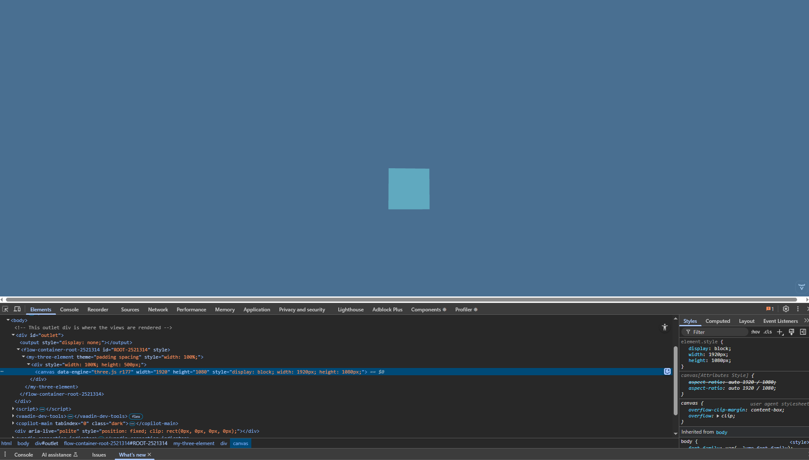
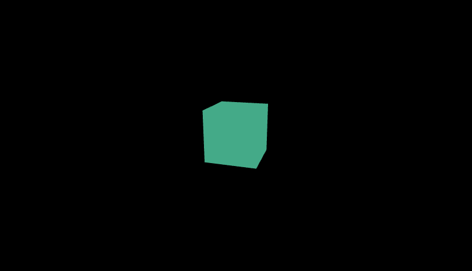

# Spring Boot with Vaadin Flow and Three.js Playground

Three.js working in Vaadin. However, an issue remains with the @Tag("my-three-element").

Loading order initialising the graphics context into the DOM might be affected.

Resizing the canvas element confirms the rendered 3D context scales, resizes and can go to a fullscreen mode

## How to get it working

To get the graphics context to display, do the following:

1. Run the code, if all is well you will see a blank screen.
2. Comment out the @Tag annotation in the HomeView.java and run the code again with hotswap. Again, you will see a blank screen.
3. Finally, uncomment the @Tag annotation and run the code with hotswap. this time the 3D context will appear and you will see a green cube in the middle of the black background.

## Build

`mvn install spring-boot:run`
